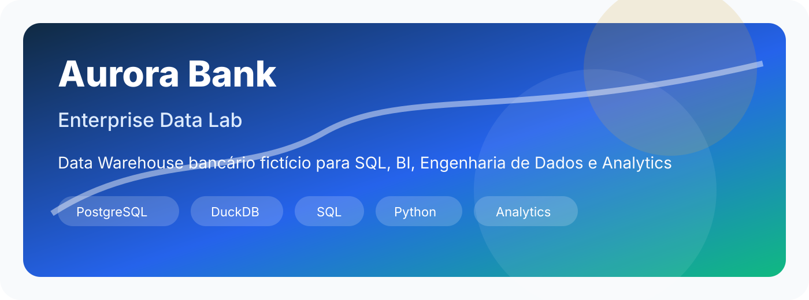
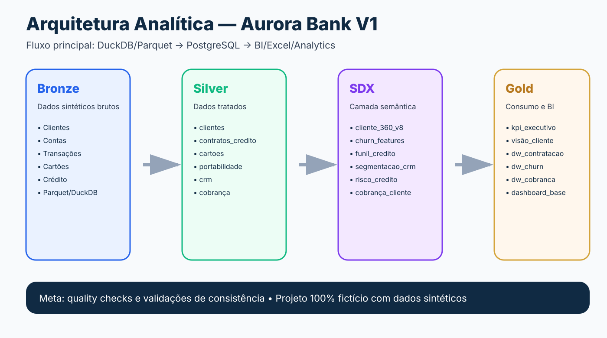

# Aurora Bank Enterprise Data Lab



## Visão geral

**Aurora Bank Enterprise Data Lab** é um projeto fictício de **Engenharia de Dados, SQL e Analytics** que simula um banco digital/múltiplo com dados sintéticos, arquitetura em camadas, PostgreSQL, DuckDB, Cliente 360, KPIs executivos e regras de negócio bancário.

O objetivo é criar um ambiente prático e realista para estudar:

- SQL aplicado ao setor financeiro;
- modelagem analítica;
- engenharia de dados;
- arquitetura Bronze, Silver, SDX, Gold e Meta;
- análise de crédito, cartões, portabilidade, CRM, canais digitais, cobrança e churn;
- construção de bases para Excel, Power BI e projetos de portfólio.

> Todos os dados são 100% sintéticos e não representam clientes, bancos ou operações reais.

---

## Identidade fictícia

O projeto simula o **Aurora Bank**, um banco digital/múltiplo brasileiro fictício, com atuação em:

- conta digital;
- cartão de crédito;
- crédito pessoal;
- consignado;
- portabilidade;
- CRM e campanhas;
- canais digitais;
- cobrança;
- análise de churn;
- visão executiva de clientes.

---

## Arquitetura



A arquitetura foi construída em camadas:

| Camada | Objetivo |
|---|---|
| **Bronze** | Dados brutos sintéticos, inicialmente gerados em DuckDB/Parquet |
| **Silver** | Dados tratados e padronizados no PostgreSQL |
| **SDX** | Camada semântica e analítica, incluindo Cliente 360 |
| **Gold** | Tabelas de consumo, DWs, KPIs e bases executivas |
| **Meta** | Quality checks e validações de consistência |

---

## Por que DuckDB e PostgreSQL?

O projeto começou em **DuckDB** por sua praticidade para geração local, leitura de Parquet e construção rápida das camadas analíticas.

Depois, as camadas tratadas e executivas foram migradas para **PostgreSQL**, com o objetivo de aproximar o projeto de um ambiente relacional corporativo, com melhor suporte para:

- conexão pelo VSCode;
- exploração de schemas;
- autocomplete;
- futuras procedures e functions;
- criação de índices;
- consultas analíticas em um banco servidor local.

Fluxo atual:

```text
DuckDB / Parquet
        ↓
PostgreSQL
        ↓
SQL / Excel / Power BI / Analytics
```

---

## Stack utilizada

- PostgreSQL
- DuckDB
- Python
- Pandas
- SQL
- VSCode
- pgAdmin
- Excel / Power BI

---

## Domínios implementados na V1

- Clientes
- Contas
- Transações
- Cartões
- Compras no cartão
- Faturas
- Crédito
- Propostas
- Contratos
- Parcelas
- Políticas de crédito
- Precificação
- Renegociação
- Portabilidade
- CRM e campanhas
- Canais digitais
- Cobrança
- Churn
- Gold executivo
- Quality checks

---

## Principais tabelas

### Cliente 360

```sql
SELECT *
FROM sdx.cliente_360_v8
LIMIT 10;
```

### Visão executiva por cliente

```sql
SELECT *
FROM gold.visao_executiva_cliente
LIMIT 10;
```

### KPIs executivos do banco

```sql
SELECT *
FROM gold.kpi_executivo_banco;
```

### DW de contratação

```sql
SELECT *
FROM gold.dw_contratacao
LIMIT 10;
```

### DW de churn

```sql
SELECT *
FROM gold.dw_churn
LIMIT 10;
```

---

## Tabelas Gold principais

| Tabela | Finalidade |
|---|---|
| `gold.kpi_executivo_banco` | Resumo executivo geral do banco |
| `gold.visao_executiva_cliente` | Visão consolidada por cliente |
| `gold.dashboard_base_executiva` | Base agregada para dashboards |
| `gold.kpi_produtos_executivo` | KPIs por domínio/produto |
| `gold.kpi_risco_executivo` | KPIs por risco, churn, cobrança e CRM |
| `gold.dw_contratacao` | DW flat de crédito/contratação |
| `gold.dw_portabilidade` | DW flat de portabilidade |
| `gold.dw_crm` | DW flat de CRM e campanhas |
| `gold.dw_canais_digitais` | DW flat de eventos digitais |
| `gold.dw_cobranca` | DW flat de cobrança |
| `gold.dw_churn` | DW flat de churn |

---

## Exemplos de análise

### Clientes críticos por churn e risco

```sql
SELECT
    num_pes,
    nome,
    segmento,
    rating_cliente,
    score_credito,
    classe_risco_relacionamento,
    faixa_risco_churn,
    score_churn,
    saldo_devedor_credito,
    saldo_npl_90,
    acao_retencao_recomendada
FROM gold.visao_executiva_cliente
WHERE classe_risco_relacionamento = 'ALTO_RISCO'
   OR flg_churn_critico = 1
ORDER BY score_churn DESC, saldo_npl_90 DESC
LIMIT 100;
```

### Produtos com maior exposição

```sql
SELECT *
FROM gold.kpi_produtos_executivo
ORDER BY valor_operado DESC;
```

### Segmentos com maior risco

```sql
SELECT
    segmento,
    classe_risco_relacionamento,
    faixa_risco_churn,
    COUNT(*) AS qtd_clientes,
    ROUND(AVG(score_churn)::numeric, 2) AS score_churn_medio,
    ROUND(SUM(saldo_npl_90)::numeric, 2) AS saldo_npl_90
FROM gold.visao_executiva_cliente
GROUP BY
    segmento,
    classe_risco_relacionamento,
    faixa_risco_churn
ORDER BY saldo_npl_90 DESC;
```

---

## Estrutura do repositório

```text
aurora-bank-enterprise-data-lab/
│
├── assets/
│   ├── aurora_bank_banner.svg
│   ├── architecture_layers.svg
│   └── ...
│
├── docs/
│   ├── STATUS_AURORA_BANK_V1.md
│   ├── DICIONARIO_RAPIDO_AURORA_BANK_V1.md
│   └── ...
│
├── scripts/
│   ├── 01_generate_bronze_clientes.py
│   ├── 03_generate_bronze_contas_transacoes.py
│   ├── 05_generate_bronze_cartoes.py
│   ├── 07_generate_bronze_credito.py
│   └── 09_migrate_duckdb_to_postgres.py
│
├── sql/
│   └── postgres/
│       ├── 01_create_dw_contratacao.sql
│       ├── 03_create_portabilidade.sql
│       ├── 05_create_crm_campanhas.sql
│       ├── 07_create_canais_digitais.sql
│       ├── 09_create_cobranca.sql
│       ├── 11_create_churn.sql
│       ├── 13_create_gold_executivo.sql
│       ├── 15_test_geral_v1.sql
│       └── 16_demanda_01_visao_executiva.sql
│
├── tasks/
│   └── DEMANDA_01_VISAO_EXECUTIVA.md
│
├── requirements.txt
├── requirements_postgres.txt
├── .gitignore
└── README.md
```

---

## Como executar localmente

### 1. Clonar o repositório

```bash
git clone https://github.com/SEU_USUARIO/aurora-bank-enterprise-data-lab.git
cd aurora-bank-enterprise-data-lab
```

### 2. Instalar dependências Python

```bash
python -m pip install -r requirements.txt
python -m pip install -r requirements_postgres.txt
```

### 3. Preparar PostgreSQL

Crie ou use um banco local chamado:

```text
aurora_bank
```

### 4. Executar scripts SQL no PostgreSQL

Execute os scripts da pasta:

```text
sql/postgres/
```

Na ordem de criação dos domínios.

---

## Status da V1

A V1 inclui:

- banco PostgreSQL funcional;
- camadas Silver, SDX, Gold e Meta;
- Cliente 360 V8;
- DWs de negócio;
- KPIs executivos;
- primeira demanda simulada;
- documentação inicial.

---

## Próximos passos

- Criar dashboard no Power BI;
- criar exports para Excel;
- adicionar procedures/functions no PostgreSQL;
- criar automações de relatório;
- evoluir para V2 com investimentos, seguros, consórcio, imobiliário e fraude/KYC;
- criar modelos de ciência de dados para churn, propensão e inadimplência.

---

## Aviso

Este projeto é fictício e educacional.  
Nenhum dado real de clientes, bancos ou instituições financeiras foi utilizado.
